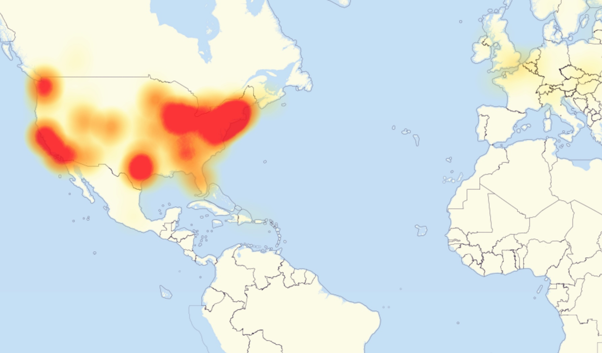
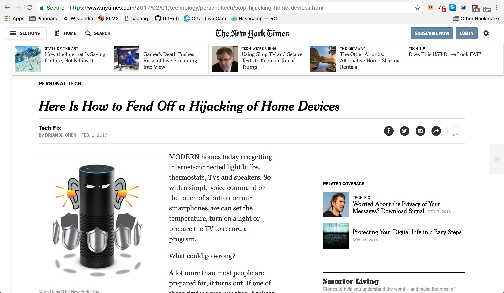

# October 21st, 2016

## 

 
<small>src: [https://en.wikipedia.org/wiki/2016_Dyn_cyberattack](https://en.wikipedia.org/wiki/2016_Dyn_cyberattack)</small>

## 

 
<small>src: [https://twitter.com/Dyn](https://twitter.com/Dyn)</small>

## 

 
<small>src: [http://enchantressofllyr.tumblr.com/](http://enchantressofllyr.tumblr.com/)</small>

<!-- Thesis -->
# Sociability Security

<!-- Objects -->
# 

##

 
<small>src: [The Verge](http://www.theverge.com/2016/4/4/11362928/google-nest-revolv-shutdown-smart-home-products)</small>

##

“I am a home automation nut. When I arrive home my lights turn on. In lieu of motion detecting lights, I have a Z-wave motion detector that notifies my Revolv when there is motion on any side of our home and turns on the appropriate lights. Although I do set a home alarm, there is really no more effective vacation security than the programatic turning on, dimming, and turning off of lights in a manner that would indicate that people are home. After buying my Revolv I put my outdoor landscaping light on it and threw away the old timer. Now at Sunset my landscape lighting turns on. Holiday lighting does the same. It’s magical.”   — Arlo Gilbert, [“The time that Tony Fadell sold me a container of hummus.”](https://arlogilbert.com/the-time-that-tony-fadell-sold-me-a-container-of-hummus-cb0941c762c1#.3m7fy21vx)

<!-- Assemblages -->
# Internet of Assemblages

## 

1. We now see how objects are entangling themselves.
2. This ability to entangle is no longer just human.

<!-- Mirai -->
# Mirai

##

 
<small>src: [https://github.com/jgamblin/Mirai-Source-Code](https://github.com/jgamblin/Mirai-Source-Code)</small>

##

 
<small>src: [https://www.incapsula.com/blog/malware-analysis-mirai-ddos-botnet.html](https://www.incapsula.com/blog/malware-analysis-mirai-ddos-botnet.html)</small>

<!-- Securitization -->
# Our Networks Work By Leaking

##

 
<small>src: [https://www.nytimes.com/2017/02/01/technology/personaltech/stop-hijacking-home-devices.html](https://www.nytimes.com/2017/02/01/technology/personaltech/stop-hijacking-home-devices.html)</small>

<!-- Closing -->
# Towards an Ethics of Vulnerability